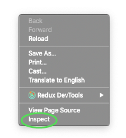
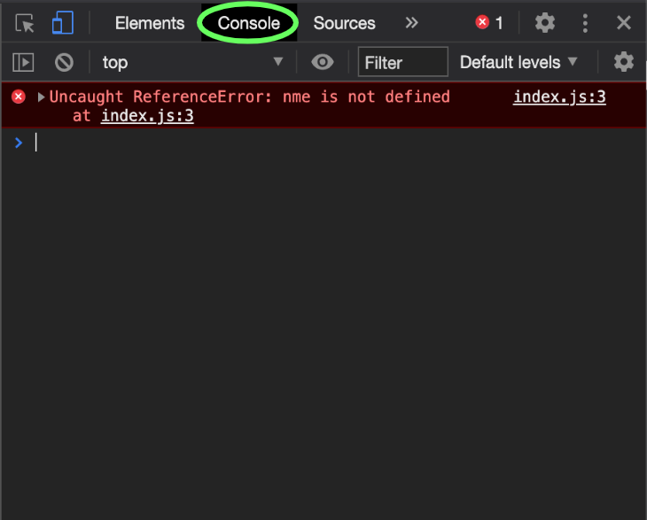
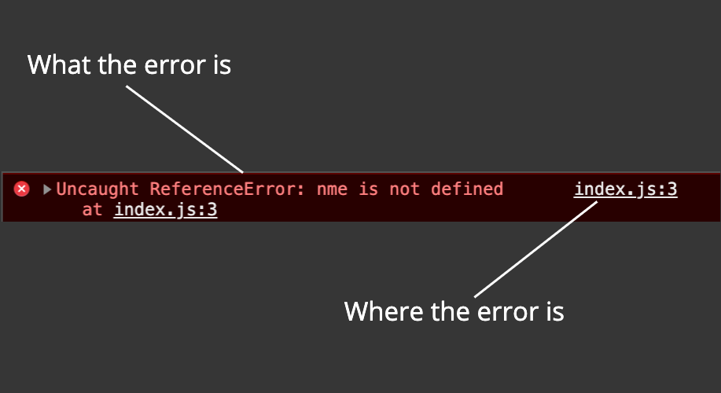
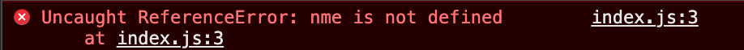
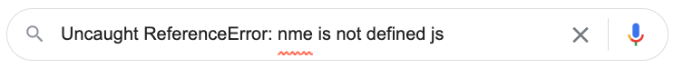
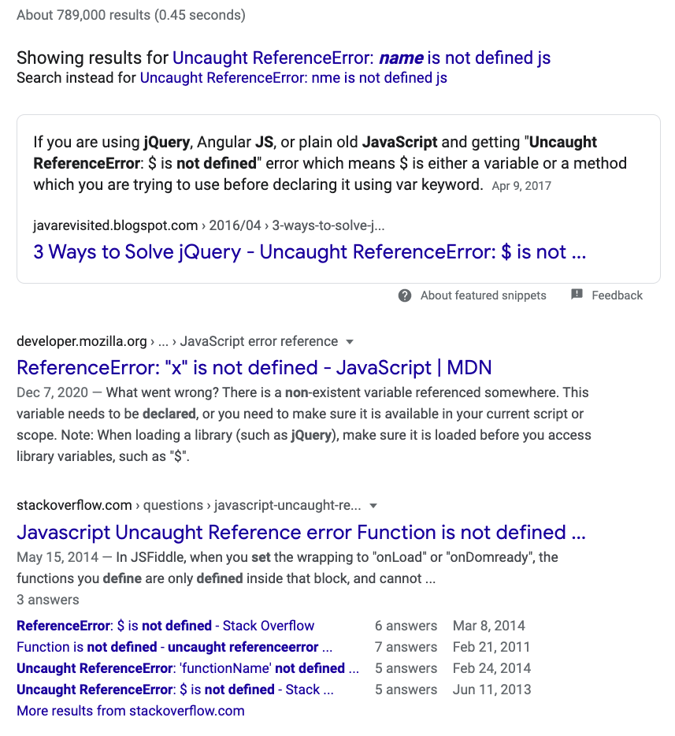
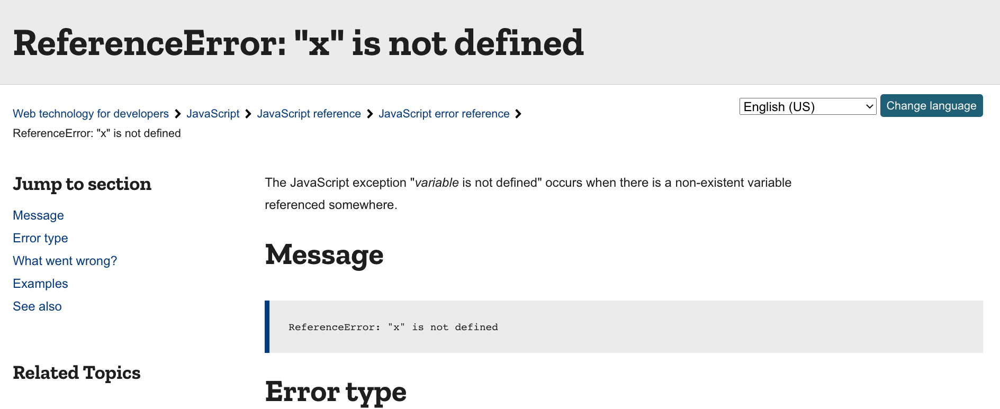

# Debugging Helper

Welcome to the debugging helper! As you are new to coding and debugging, this repository is meant to give you a head start on how to resolve errors in your code. This is extremely important, as being able to solve bugs in your code is a very common task for developers of any level. In this repository you will find:

* How to find your developer console
* How to read errors in your developer console
* Steps to solving errors in your code
* How to search Google for solutions to your errors
* Common errors in code and how to resolve them

## How to find your developer console

Many browsers contain a developer console that will allow you to see the result of console.logs, as well as see errors and warnings in your code. While at DevMountain, it's recommended that you use Google Chrome, as it has a wide variety of developer tools that are simple and easy to use. To find your developer console, right click in your web browsers viewport and click the 'inspect' button. You can also use the hotkeys: command + option + j for Mac, control + shift + j for Windows and Linux.

Your developer tools will now be open. There are many tools to work with, and we will dive into some more of them during Unit 7. Find the tab that says console, and click it.

This is your developer console! From here you will be able to read your errors and work towards resolving them.

## How to read errors in your developer console

Errors in your code may come in many forms. Most often, errors in your code will display an error message in your developer console. These error messages are extremely useful, as they contain what the error is, and where the error is taking place.

Understanding how to read an error message like the one above is the first step in being able to resolve it. Knowing the information of what the error is gives you direction in what you can search for to find a solution, and knowing where the error is allows you to see the code that isn't functioning properly.

## Steps to solving errors in your code

When you have an error in your code, it can be easy to get frustrated and not know where to go with it. Follow these steps to get you started:

1. Check for typos in your code based on where the error message says the error is. Typos are a VERY common error
2. Check for extra or missing parenthesis or brackets ((), [], or {}). When new to functions, objects, and arrays, it can be easy to forget a bracket or add an extra one
3. Reference lecture material from that day (lecture slides, lecture notes, lecture video), and see if you missed something
4. Google the error found in the error message
5. Use the Q

Following these steps will give you some structure on where to go when an error comes up.

## How to search Google for solutions to your errors

Google is a developers best friend. There are many resources that can be found through Google to help you find solutions to your code. However, it is important to learn when a resource is relevant or not. This section will help you make that distinction.

Let's say you come across the following error:

To search an error like this most effectively, you would take the portion that defines what the error is (Uncaught ReferenceError: nme is not defined or just Uncaught ReferenceError) followed by js (standing for JavaScript), like so:

Including both the error you are running into, as well as the language you are coding in will help you narrow the search results to be more relevant. However, you can still run into some resources not related to the error you are having. Consider the first three options that come up from the above search:

The first option contains a link to JQuery. While this may contain an answer that can help you, it could also contain a bunch of confusing syntax that you are unfamiliar with (as it is more focused on JQuery than plain JavaScript). Looking at the next two options, the links seem more promising. Make sure to read the description of the resource, not just the title, as the description can help you determine how relevant it is to your specific problem.

The second resource above (from MDN) contains a title with the specific error you have, and a description that seems promising to helping you solve your error. When you click into this resource, you can see the following:

Immediately from this description of the error, we can see that this type of error occurs when we are referencing a variable that doesn't exist in our code. You can take that information to then check if you had a typo when you were trying to reference an existing variable, or you referenced a variable that you never declared to begin with.

Regardless of the error in your code, you can follow these steps to find relevant information. To recap:

* Open your console to find the error message
* Copy that message and paste it into Google search, followed by the language you are working in (js for JavaScript)
* Read the title and description of the resources to find one that is relevant to your error
* Use the resource to help you find a solution.

If the first resource you check doesn't contain a solution to your error, that's OK. Go back and check other resources from your search, and see if there are other resources that could help you. Understand that it can take time to become proficient at finding solutions to errors through Google, but it's an immensely valuable skill to obtain, so always give it a shot when you come across an error.

